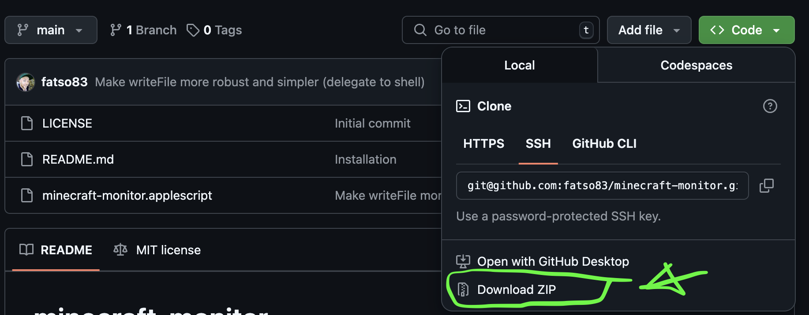

# game-warden
> Monitor screen time on macOS of games (or other processes) and kill them if the user exceeds the thresholds

# What is it?
Originally, this was a a script to fix Minecraft issue [(MCL-14705)](https://bugs.mojang.com/browse/MCL/issues/MCL-14705),
which is that Apple's Screen Time feature sucks at controlling applications that are built
using Java technology. Previously it did not block them at all, and per July 2025 it
only recognises `java`, but it counts all time the process is active (even if in the background), which
defeats the entire purpose of only counting actual play time ...

This script basically works by asking macOS to keep tabs on the monitored processes
and, once we go over the daily or weekly threshold, kill them (after alerting the user to exit).

# Installation


## 1. Download the files
Most non-techies should just download the files as a zip-file and unzip it in `~/Downloads`. To unzip, just double-click the file once the download has finished. The ones that are well versed in Git can just clone the repo.

## 2. Run the install script
Now you need to navigate to the folder in the `Terminal.app`. If you have opened the Terminal app, you will typically now type the following:

```bash
cd ~/Downloads/game-warden-main
./install.sh
```

That's it!

## 3. Customise the settings
You can see the basic settings in the file `config.plist`, which you can open in any text editor. Example:
```xml
    <!-- hour:minutes -->
    <key>weeklyMax</key>
    <string>5:00</string>

    <!-- hour:minutes -->
    <key>Monday</key>
    <string>1:00</string>
    ...

    <key>processPatterns</key>
    <dict>
        <key>minecraft</key><string>java.*[m]inecraft</string>
        <key>steam-games</key><string>steamapps</string>
        ...
```
Just change the values as you see fit. This is what I found right for my 7 year old. Once you feel you have the settings right, just re-run `./install.sh`.

# Development

If you want to hack on this, feel free! You might find it useful to observe these tips:

## Control logging via env vars
AppleScript is terrible at debugging, only giving you an offset in chars (?) indicating what went wrong.
Configurable logging has proven essential, to avoid commenting code in and out.

When developing and/or debugging this, I usually uninstall the program from the current user to not have weird result and then run it like this:
```bash
GW_LOG_LEVEL=TRACE GW_APPENDER=stderr osascript game-warden.applescript config.plist
```

## Figuring out where something went wrong
As mentioned, AppleScript is terrible at debugging, often just giving you an offset in characters, not lines.
To figure out what is happening at offset 5435, I usually just do this to get some context:
```bash
dd if=game-warden.applescript of=/dev/stdout bs=1 skip=5420 count=100
```
This outputs 100 bytes, starting 15 chars before the offset.

# Acknowledgements

This started as a straight up copy of user "jhopgei"'s (Jürgen, last name unknown) Applescript shared on the
[Mojang bug tracker (MCL-14705)](https://bugs.mojang.com/browse/MCL/issues/MCL-14705).
I then asked ChatGPT to translate the field names into English. Following that, I basically
I made changes to make it more easily installable, distributable and configurable
by moving all user configurable bits out of the AppleScript code.

I also made the script that is passed around uncompiled, meaning it is
simple to view and edit with a simple text editor, and of course, easily tracked in Git.
I still compile it at install time. I also added extra features, an install and uninstall script,
etc, etc and in the end made it not minecraft specific at all. Check the commit log :)

